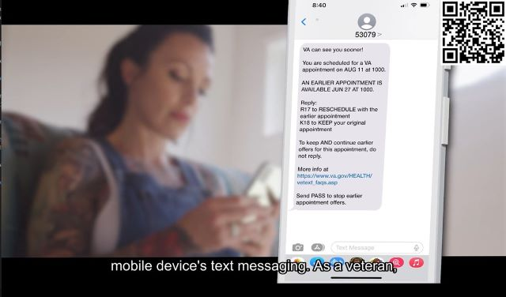

# SCIDVid
## A script to caption and add QR codes to waiting room videos



## Introduction
This python script uses `ffmpeg-python` and Assembly AI, both are free but must be downloaded. `ffmpeg` must be installed first, and it is approved for use on VA computers but requires IT to install. Python must be installed by them too but the `assemblyai` and `ffmpeg-python` libraries can be installed by the end user. 

## Clone the project locally
```
$ git clone https://github.com/gmarzloff/scidvidprocessor.git
```

## Install libraries from a terminal 

I found that Gitbash caused fewer path headaches with python and git in Windows.

```bash
$ pip install ffmpeg
$ pip install assemblyai
```
## Acquire video (and maybe audio track)

First, create a media folder in the repository. It is ignored from version control. The script is setup to find the files based on the same base name, for example: 
```
filename_no_ext         = "open_slot_mgmt"
video_source_filename   = "media/" + filename_no_ext + ".mp4"
audio_output_filename   = "media/" + filename_no_ext + "_audio.m4a"
captions_output         = "media/" + filename_no_ext + "_captions.srt"
video_with_subs_filename= "media/" + filename_no_ext + "_withsubs.mp4"
qrcode_filename         = "media/" + filename_no_ext + "_qrcode.jpg"

```

This [youtube downloader](https://ytdl.hamsterlabs.de/) is not blocked on the network, but the 1080p file does not come with an audio track. 
For now you will need to manually uncomment the right line to load the audio: 

```python
# Uncomment if video already has audio
# audio_stream = ffmpeg.input(video_source_filename).audio 

# Use this if the audio file is separate
audio_stream = ffmpeg.input(audio_output_filename).audio 
```

If you do not have a separate audio file, separate it out to generate captions. 

```
$ python scidvid.py audio
```
This exports an audio file in the same directory as the video.

## Autogenerate captions 

Captioning requires a free account with [AssemblyAI](https://assemblyai.com). The first 100 hours of transcription are free. Note: the VA proxy blocks using SSL to interact with AssemblyAI. You can switch to a wifi hotspot temporarily to work with the API.

Create a `private` folder in the repository and save the API key here. It is ignored in version control. 
```
$ mkdir private
$ echo "Paste your key here" > private/assemblyai.key
```

Then use the API to to create captions. 

```bash
$ python scidvid.py captions
```
This exports a `.srt` subtitles file in the same folder. Review the file to fix an occasional wrong word. 

## QR Code
A QR code can be helpful for a viewer to access the entire video on their phone for later viewing. Actually, the link can be for anything and is not limited to the video's online URL. 

Any generator can be used but [this one](https://www.the-qrcode-generator.com/) requires the least hassle and is accessible on the VA network. 

You may want to resize the image depending on the size of your video file. A 300px QR code will take up 15% of the width of a 1920x1080 video. After the image is prepped and saved with the right path and name as above, this part is done. The script will align it to the top right corner of the file next.

## Render the video

```bash
$ python scidvid.py burn
```

ffmpeg-python will generate a new video file in the same folder. Expect the processing to take about 40% slower than the duration of the video file. The status tells you in the terminal. Go get coffee!